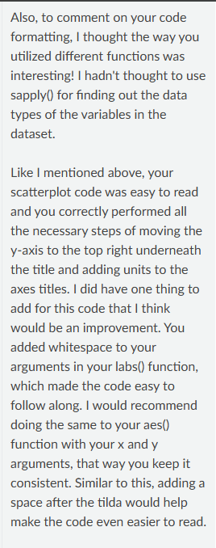
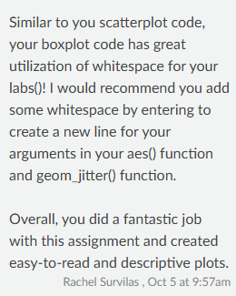

[**My Grade:**]{.underline} I believe my grade equivalent to course work evidenced below to be an A-.

[**Learning Objective Evidence:**]{.underline} In the code chunks below, provide code from Lab or Challenge assignments where you believe you have demonstrated proficiency with the specified learning target. Be sure to specify **where** the code came from (e.g., Lab 4 Question 2).

## Working with Data

**WD-1: I can import data from a *variety* of formats (e.g., csv, xlsx, txt, etc.).**

-   `csv` Example 1

```{r}
#| label: wd-1-csv-1

#Lab 3. Question 2. 

teacher_evals <- read_csv(here::here("Week 3", "Lab 3", "teacher_evals.csv"))

```

-   `csv` Example 2

```{r}
#| label: wd-1-csv-2

#Lab 4. Question 0. 

childcare_costs <- read_csv('https://raw.githubusercontent.com/rfordatascience/tidytuesday/master/data/2023/2023-05-09/childcare_costs.csv')

counties <- read_csv('https://raw.githubusercontent.com/rfordatascience/tidytuesday/master/data/2023/2023-05-09/counties.csv')

tax_rev <- read_csv('https://atheobold.github.io/groupworthy-data-science/labs/instructions/data/ca_tax_revenue.csv')

```

-   `xlsx`

```{r}
#| label: wd-1-xlsx

#PA 4. Question 1. 

military <- read_xlsx("gov_spending_per_capita.xlsx",
                      sheet = "Share of Govt. spending",
                      skip  = 7,
                      n_max = 190,
                      na = c(". .", "xxx", "..")
                      )

```

**WD-2: I can select necessary columns from a dataset.**

-   Example selecting specified columns

```{r}
#| label: wd-2-ex-1

#Lab 3. This chunk satisfies the ability to select specified columns for this learning target.

teacher_evals_clean <- teacher_evals |> 
  rename(sex = gender) |> 
  filter(no_participants > 10) |> 
  mutate(
    across(
      .cols = c(teacher_id, course_id),
      .fns = ~ as.character(.x))
    )|> 
  select(
    course_id,
    teacher_id,
    question_no,
    no_participants,
    resp_share,
    SET_score_avg,
    percent_failed_cur,
    academic_degree,
    seniority,
    sex)

```

-   Example removing specified columns

```{r}
#| label: wd-2-ex-2

# Lab 9. Growing: Can you format the percentages to have 2 decimal places and include a % symbol at the end? In this code chunk I included fmt_percent with decimals = 2 to add both the percentage sign and 2 decimal places. I also selected academic_degree, sen_level, and sex by removing the other columns in the evals dataset. 

evals |> 
  filter(no_participants > 10) |> 
  mutate(
    across(
      .cols = c(teacher_id, course_id),
      .fns = ~ as.character(.x)),
      sen_level = case_when(seniority <=4 ~ "junior",
                               seniority >= 5  ~ "senior")
    ) |> 
  
  distinct(teacher_id, .keep_all = TRUE) |> 

  select(
    -c(course_id,
       teacher_id,
       question_no,
       no_participants,
       resp_share,
       SET_score_avg,
       percent_failed_cur,
       question_no,
       no_participants,
       resp_share,
       SET_score_avg,
       percent_failed_cur)
    ) |>

  pivot_longer(
    cols = everything(),
    names_to = "variable",
    values_to = "value"
  ) |> 
  
  count(variable, value) |> 
  
  group_by(variable) |> 
  
  mutate(
    
    prop = (n/sum(n)),
    
    value = recode(
      value, 
        "junior" = "Junior",
        "senior" = "Senior",
        "male" = "Male",
        "female" = "Female",
        "no_dgr" = "No degree",
        "prof" = "Professor",
        "ma" = "Masters",
        "dr" = "Doctorate")
  ) |> 
  
gt() |> 
  tab_header(
    title = "Demographic of Professors",
    subtitle = "Student Evaluations at the University of Poland, Warsaw in 2020"
  ) |> 
  cols_label(
    n = md("**Count**"),
    prop = md("**%**"),
    value = md("**Demographic**")
  ) |> 
  tab_spanner(
    label = md("**Professors**"),
    columns = c(n, prop)
  ) |> 
  tab_row_group(
    label = md("**Seniority**"),
    rows = value %in% c("Junior", "Senior")
  ) |> 
  tab_row_group(
    group = md("**Sex**"),
    rows = value %in% c("Female", "Male")
  ) |> 
  tab_row_group(
    group = md("**Academic Degree**"),
    rows = value %in% c("No degree", "Masters", "Doctorate", "Professor")
  ) |> 
  tab_style(
    style = cell_fill(color = "lightgray"), 
    locations = cells_row_groups()           
  ) |> 
  fmt_percent(
    columns = prop,
    decimals = 2
  )

```

-   Example selecting columns based on logical values (e.g., `starts_with()`, `ends_with()`, `contains()`, `where()`)

```{r}
#| label: wd-2-ex-3

#Lab 4. Question 7. 

#Growing: case_when() works, but you were asked to use a function from the forcats package to accomplish this! The same goes for factor()!

#In this code chunk I changed the column identifiers for pivot_longer so instead of selecting multiple columns using a colon I used the function starts_with. This was seen in the first portion of the chunk before ggplot and was expertly crafted by Dr. T!I modified this code for the resubmission but not for this learning target.

ca_childcare |> 
  select(census_region,
         study_year,
         mc_infant, 
         mc_toddler,
         mc_preschool) |> 
  pivot_longer(cols = starts_with("mc_"),
               names_to = "Age",
               values_to = "Price") |> 
  mutate(Age = fct_recode(Age,
                              "Infant" = "mc_infant",
                              "Toddler" = "mc_toddler",
                              "Preschool" = "mc_preschool"),
       Age = fct_relevel(Age, 
                                "Infant",
                                "Toddler",
                                "Preschool")
     ) |> 
  ggplot(aes(x = study_year,
             y = Price,
             color = fct_reorder2(.f = census_region,
                                  .x = study_year,
                                  .y = Price)
             ) 
           ) +
  geom_point() +
  facet_wrap(~ Age) + 
  labs(
    x = "Study Year",
    y = " ",
    color = "California Region",
    title = "Weekly Median Price for Center-Based Childcare ($)"
  ) +
  scale_color_discrete(
    name = "California Region"
  ) +
  geom_smooth(method = loess) + 
  scale_y_continuous(limits = c(100, 500),
                     breaks = seq(
                       from = 0, 
                       to = 500, 
                       by = 100)) +
  scale_x_continuous(limits = c(2008, 2018),
                     breaks = seq(
                       from = 2008,
                       to = 2018,
                       by = 2
                     )) +
  theme_bw() +
  theme(
    aspect.ratio = 1,
    axis.text.x = element_text(size = 7),
    axis.text.y = element_text(size = 7),
    legend.text = element_text(size = 9),
    panel.spacing = unit(0.5, "lines") 
  ) + 
  scale_color_manual(values = plot_colors)

```

**WD-3: I can filter rows from a dataframe for a *variety* of data types (e.g., numeric, integer, character, factor, date).**

-   Numeric Example 1

```{r}
#| label: wd-3-numeric-ex-1

#Lab 3 Question 9. This code chunk shows that I can select specified columns and filter from the teacher_evals dataset for the amount of participants to be greater than 10.

teacher_evals_clean <- teacher_evals |> 
  rename(sex = gender) |> 
  filter(no_participants > 10) |> 
  mutate(
    across(
      .cols = c(teacher_id, course_id),
      .fns = ~ as.character(.x))
    )|> 
  select(
    course_id,
    teacher_id,
    question_no,
    no_participants,
    resp_share,
    SET_score_avg,
    percent_failed_cur,
    academic_degree,
    seniority,
    sex)

```

-   Numeric Example 2

```{r}
#| label: wd-3-numeric-ex-2

#Question 5 Lab 4. 

#Growing: I would recommend using the %in% operator instead of a ==! This will not always work for a vecor of values!

#In this chunk I filtered the study year to only include the years 2008 and 2018.This chunk was modified for my resubmission but not for this learning target.

ca_childcare |> 
  filter(study_year %in% c(2008, 2018)) |> 
  group_by(census_region, study_year) |>  
  summarise(median_household_income = median(mhi_2018, na.rm = TRUE),
            .groups = "drop") |>
  pivot_wider(names_from = study_year,
              values_from = median_household_income) |>
  arrange(desc(`2018`))

```

-   Character Example 1 (any context)

```{r}
#| label: wd-3-character

#Lab 5. In this code chunk I filtered the gym membership status to only include gold membership. 

inner_join(
  x = DL_person,
  y = get_fit_now_member,
  by = "name"
) |> 
  filter(membership_status == "gold",
         str_detect(plate_number,
                    pattern = "H42W"))

```

-   Character Example 2 (example must use functions from **stringr**)

```{r}
#| label: wd-3-string

#Lab 5. I used the str_detect function to identify the plate number of the suspect by the first 4 characters.

inner_join(
  x = DL_person,
  y = get_fit_now_member,
  by = "name"
) |> 
  filter(membership_status == "gold",
         str_detect(plate_number,
                    pattern = "H42W"))

```

-   Date (example must use functions from **lubridate**)

```{r}
#| label: wd-3-date

#Lab 5 - finding the suspect. In this chunk I filtered the date by December (month) and 2017 (year). Originally I had used str_detect to find the character 201712 but to satisfy this learning target I changed the date column to actual dates and then filtered. I took insipration from a past student's exemplary work.

new_suspect <- 
  drivers_license |> 
  full_join(facebook_event_checkin,
            by = join_by(id == person_id)) |> 
  filter(height >= 65 & height <= 67,
         hair_color == "red",
         gender == "female",
         car_make == "Tesla",
         car_model == "Model S"
         ) |>  
  # rename column so keys match
  rename(license_id = id) |> 
  inner_join(person,
             by = "license_id") |>
  inner_join(facebook_event_checkin,
             join_by(id == person_id)) |> 
  mutate(date = ymd(date.y)) |>
  filter(year(date) == 2017, 
         month(date) == 12,
         event_name.y == "SQL Symphony Concert") |> 
  group_by(id,
           name) |> 
  summarize(event_count = n(),
            .groups = "drop") |> 
  filter(event_count == 3)

interview |> 
  semi_join(new_suspect,
            by = join_by(person_id == id)) |> 
  pull(transcript)

```

**WD-4: I can modify existing variables and create new variables in a dataframe for a *variety* of data types (e.g., numeric, integer, character, factor, date).**

-   Numeric Example 1

```{r}
#| label: wd-4-numeric-ex-1

#Lab 3. Question 9. In this code chunk I created a new variable, distinct_questions_asked, which counted the total amount of unique questions students asked in the survey. 

teacher_evals_clean |> 
  group_by(
    teacher_id,
    course_id
  ) |> 
  summarize(
    distinct_questions_asked = n_distinct(question_no)
    ) |>
  filter(
    distinct_questions_asked == 9
    ) |> 
  kable()

```

-   Numeric Example 2

```{r}
#| label: wd-4-numeric-ex-2

#Challlenge 4. 

#Satisfactory: I use plot modifications to make my visualizations clearer to the reader. Satisfactory: I can create tables which make my summaries clear to the reader.

#Creating a summary table. In this code chunk I modified my data summary table to include a column of the overall median childcare price based on type (family-based or center-based) for 5 groups of overall proportion of Californians who identified as Hispanic. With the summarize line I created a new value of the overall median of childcare price, which before was the median price for each county for each year. This code was originally changed for my resubmission but not for this learning target. 

ca_childcare |>
  mutate(
    Hispanic_group = cut(
      hispanic,
      breaks = c(0, 20, 40, 60, 80, 100),
      labels = c("0–20%", "20–40%", "40–60%", "60–80%", "80–100%"),
      include.lowest = TRUE,
      right = FALSE
    )
  ) |>
  pivot_longer(
    cols = c(mfccsa, mcsa),
    names_to = "Childcare_Type",
    values_to = "Median_Price"
  ) |>
  group_by(Hispanic_group, Childcare_Type) |>
  summarize(
    Median_Price = median(Median_Price, na.rm = TRUE),
    .groups = "drop"
  ) |>
  arrange(Hispanic_group, Childcare_Type)

```

-   Factor Example 1 (renaming levels)

```{r}
#| label: wd-4-factor-ex-1

#Lab 4. Question 7. 

#Growing: Nice work pivoting and modifying the age variable! I am specifically looking for a tool that does the reordering of the legend for you since doing the reordering by hand is not a robust programming practice! Nice work changing the size of the x-axis text! Can you make this change to other aspects of the plot? Can you reorder the facets so they go in the same order as mine? Can you match my colors??? These are coming from a package and you will need to expand the color palette to get all 10 colors.

#I used fct_relevel to relevel the Age factor so that it would plot properly in the same order as Dr. T's. This was changed from my original code for my resubmission but not to satisfy this learning target.  

ca_childcare |> 
  select(census_region,
         study_year,
         mc_infant, 
         mc_toddler,
         mc_preschool) |> 
  pivot_longer(cols = mc_infant : mc_preschool,
               names_to = "Age",
               values_to = "Price") |> 
  mutate(Age = fct_recode(Age,
                              "Infant" = "mc_infant",
                              "Toddler" = "mc_toddler",
                              "Preschool" = "mc_preschool"),
       Age = fct_relevel(Age, 
                                "Infant",
                                "Toddler",
                                "Preschool")
       )  |> 
  ggplot(aes(x = study_year,
             y = Price,
             color = fct_reorder2(.f = census_region,
                                  .x = study_year,
                                  .y = Price)
             ) 
           ) +
  geom_point() +
  facet_wrap(~ Age) + 
  labs(
    x = "Study Year",
    y = " ",
    color = "California Region",
    title = "Weekly Median Price for Center-Based Childcare ($)"
  ) +
  scale_color_discrete(
    name = "California Region"
  ) +
  geom_smooth(method = loess) + 
  scale_y_continuous(limits = c(100, 500),
                     breaks = seq(
                       from = 0, 
                       to = 500, 
                       by = 100)) +
  scale_x_continuous(limits = c(2008, 2018),
                     breaks = seq(
                       from = 2008,
                       to = 2018,
                       by = 2
                     )) +
  theme_bw() +
  theme(
    aspect.ratio = 1,
    axis.text.x = element_text(size = 7),
    axis.text.y = element_text(size = 7),
    legend.text = element_text(size = 9),
    panel.spacing = unit(0.5, "lines") 
  ) + 
  scale_color_manual(values = plot_colors)

```

-   Factor Example 2 (reordering levels)

```{r}
#| label: wd-4-factor-ex-2

#Lab 4. Question 7. Growing: Nice work pivoting and modifying the age variable! I am specifically looking for a tool that does the reordering of the legend for you since doing the reordering by hand is not a robust programming practice! Nice work changing the size of the x-axis text! Can you make this change to other aspects of the plot? Can you reorder the facets so they go in the same order as mine? Can you match my colors??? These are coming from a package and you will need to expand the color palette to get all 10 colors.

#I used fct_reorder to reorder the legend based on the census_region. I made text changes to other elements of the plot (y-axis and legend), and I reordered the facets so they went in the same order as Dr. T's. This was changed from my original code for my resubmission but not to satisfy this learning target.  

library(RColorBrewer)
plot_colors <- colorRampPalette(brewer.pal(7, "Accent"))(10)

ca_childcare |> 
  select(census_region,
         study_year,
         mc_infant, 
         mc_toddler,
         mc_preschool) |> 
  pivot_longer(cols = mc_infant : mc_preschool,
               names_to = "Age",
               values_to = "Price") |> 
  mutate(Age = fct_recode(Age,
                              "Infant" = "mc_infant",
                              "Toddler" = "mc_toddler",
                              "Preschool" = "mc_preschool"),
       Age = fct_relevel(Age, 
                                "Infant",
                                "Toddler",
                                "Preschool")
       ) |> 
  ggplot(aes(x = study_year,
             y = Price,
             color = fct_reorder2(.f = census_region,
                                  .x = study_year,
                                  .y = Price)
             ) 
           ) +
  geom_point() +
  facet_wrap(~ Age) + 
  labs(
    x = "Study Year",
    y = " ",
    color = "California Region",
    title = "Weekly Median Price for Center-Based Childcare ($)"
  ) +
  scale_color_discrete(
    name = "California Region"
  ) +
  geom_smooth(method = loess) + 
  scale_y_continuous(limits = c(100, 500),
                     breaks = seq(
                       from = 0, 
                       to = 500, 
                       by = 100)) +
  scale_x_continuous(limits = c(2008, 2018),
                     breaks = seq(
                       from = 2008,
                       to = 2018,
                       by = 2
                     )) +
  theme_bw() +
  theme(
    aspect.ratio = 1,
    axis.text.x = element_text(size = 7),
    axis.text.y = element_text(size = 7),
    legend.text = element_text(size = 9),
    panel.spacing = unit(0.5, "lines") 
  ) + 
  scale_color_manual(values = plot_colors)

```

-   Character (example must use functions from **stringr**)

```{r}
#| label: wd-4-string

#Lab 4. Creating a summary table. 

#Satisfactory: I use plot modifications to make my visualizations clearer to the reader. Satisfactory: I can create tables which make my summaries clear to the reader.

#In this code chunk after creating the table of 5 different Hispanic proportion groups by childcare type and overall median price by type, I modified my code to replace the values of childcare type by the words "family-based" for "mfccsa" and center-based by "mcsa" so that way it would be easier to read the summary table 

ca_childcare |>
  mutate(
    Hispanic_group = cut(
      hispanic,
      breaks = c(0, 20, 40, 60, 80, 100),
      labels = c("0–20%", "20–40%", "40–60%", "60–80%", "80–100%"),
      include.lowest = TRUE,
      right = FALSE
    )
  ) |>
  pivot_longer(
    cols = c(mfccsa, mcsa),
    names_to = "Childcare_Type",
    values_to = "Median_Price"
  ) |>
  group_by(Hispanic_group, Childcare_Type) |>
  summarize(
    Median_Price = median(Median_Price, na.rm = TRUE),
    .groups = "drop"
  ) |>
  mutate(
    Childcare_Type =
      str_replace_all(Childcare_Type,
                      "mcsa", 
                      "Center-based"),
    Childcare_Type = 
      str_replace_all(Childcare_Type,
                      "mfccsa",
                      "Family-based")
  ) |> 
  arrange(Hispanic_group, Childcare_Type)
           

```

-   Date (example must use functions from **lubridate**)

```{r}
#| label: wd-4-date

#Lab 5 - finding the person who hired the murderer. Originally I had this code as two separate pipelines with a new object that joined the drivers_license dataset with the person dataset. However, I decided to follow in an exemplary student's and Dr. T's footsteps and joined separate datasets together in one pipeline while converting the date column into actual dates, then filtering this column for December 2017 events. 

new_suspect <- 
  drivers_license |> 
  full_join(facebook_event_checkin,
            by = join_by(id == person_id)) |> 
  filter(height >= 65 & height <= 67,
         hair_color == "red",
         gender == "female",
         car_make == "Tesla",
         car_model == "Model S"
         ) |>  
  # rename column so keys match
  rename(license_id = id) |> 
  inner_join(person,
             by = "license_id") |>
  inner_join(facebook_event_checkin,
             join_by(id == person_id)) |> 
  mutate(date = ymd(date.y)) |>
  filter(year(date) == 2017, 
         month(date) == 12,
         event_name.y == "SQL Symphony Concert") |> 
  group_by(id,
           name) |> 
  summarize(event_count = n(),
            .groups = "drop") |> 
  filter(event_count == 3)

interview |> 
  semi_join(new_suspect,
            by = join_by(person_id == id)) |> 
  pull(transcript)

```

**WD-5: I can use mutating joins to combine multiple dataframes.**

-   `left_join()` Example 1

```{r}
#| label: wd-5-left-ex-1

#Lab 5 - finding suspect. In this chunk I redid some lines from my code before. I added a left_join to the bottom in order to pull the transcript of the murderer from the interview dataset. 

drivers_license |> 
  full_join(facebook_event_checkin,
            by = join_by("id" == "person_id")) |> 
  filter(height >= 65 & height <= 67,
         hair_color == "red",
         gender == "female",
         car_make == "Tesla",
         car_model == "Model S"
         ) |>  
  # rename column so keys match
  rename(license_id = id) |> 
  inner_join(person,
             by = "license_id") |>
  inner_join(facebook_event_checkin,
             join_by("id" == "person_id")) |> 
  mutate(date = ymd(date.y)) |>
  filter(year(date) == 2017, 
         month(date) == 12,
         event_name.y == "SQL Symphony Concert") |> 
  group_by(id,
           name) |> 
  summarize(event_count = n(),
            .groups = "drop") |> 
  filter(event_count == 3) |> 
  left_join(interview, 
            by = join_by("id"=="person_id"))

```

-   `right_join()` Example 1

```{r}
#| label: wd-5-right

#Lab 5. Changed this code from before so instead of using inner_join I changed the dataset order and used right_join. 

right_join(
  x = get_fit_now_member,
  y = DL_person,
  by = "name"
) |> 
  filter(membership_status == "gold",
         str_detect(plate_number,
                    pattern = "H42W"))

```

-   `left_join()` **or** `right_join()` Example 2

```{r}
#| label: wd-5-left-right-ex-2

#Lab 5. I changed the code from above so instead of using full_join to combine the drivers_license dataset with the facebook_event_checkin I used left_join.

drivers_license |> 
  left_join(facebook_event_checkin,
            by = join_by("id" == "person_id")) |> 
  filter(height >= 65 & height <= 67,
         hair_color == "red",
         gender == "female",
         car_make == "Tesla",
         car_model == "Model S"
         ) |>  
  # rename column so keys match
  rename(license_id = id) |> 
  inner_join(person,
             by = "license_id") |>
  inner_join(facebook_event_checkin,
             join_by("id" == "person_id")) |> 
  mutate(date = ymd(date.y)) |>
  filter(year(date) == 2017, 
         month(date) == 12,
         event_name.y == "SQL Symphony Concert") |> 
  group_by(id,
           name) |> 
  summarize(event_count = n(),
            .groups = "drop") |> 
  filter(event_count == 3) |> 
  left_join(interview, 
            by = join_by("id"=="person_id"))

```

-   `inner_join()` Example 1

```{r}
#| label: wd-5-inner-ex-1

#Lab 5. In this section I used an inner_join to combine the DL_person dataset and get_fit_now_member dataset.

inner_join(
  x = DL_person,
  y = get_fit_now_member,
  by = "name"
) |> 
  filter(membership_status == "gold",
         str_detect(plate_number,
                    pattern = "H42W"))

```

-   `inner_join()` Example 2

```{r}
#| label: wd-5-inner-ex-2

#Lab 5 - finding the suspect. From an exemplary student's work I learned how to join multiple datasets (specifically the person dataset with drivers license and then with the Facebook event checkin) to figure out who hired the murderer. 

new_suspect <- 
  drivers_license |> 
  full_join(facebook_event_checkin,
            by = join_by(id == person_id)) |> 
  filter(height >= 65 & height <= 67,
         hair_color == "red",
         gender == "female",
         car_make == "Tesla",
         car_model == "Model S"
         ) |>  
  # rename column so keys match
  rename(license_id = id) |> 
  inner_join(person,
             by = "license_id") |>
  inner_join(facebook_event_checkin,
             join_by(id == person_id)) |> 
  mutate(date = ymd(date.y)) |>
  filter(year(date) == 2017, 
         month(date) == 12,
         event_name.y == "SQL Symphony Concert") |> 
  group_by(id,
           name) |> 
  summarize(event_count = n(),
            .groups = "drop") |> 
  filter(event_count == 3)

interview |> 
  semi_join(new_suspect,
            by = join_by(person_id == id)) |> 
  pull(transcript)

```

**WD-6: I can use filtering joins to filter rows from a dataframe.**

-   `semi_join()`

```{r}
#| label: wd-6-semi

#Lab 5 - finding the suspect. I learned how to use a semi_join for this code chunk through this example Dr. T showed in class. Originally I had code that did not use the lubridate package and all these inner_joins, but I decided to change my code to fit this learning target. 

new_suspect <- 
  drivers_license |> 
  full_join(facebook_event_checkin,
            by = join_by(id == person_id)) |> 
  filter(height >= 65 & height <= 67,
         hair_color == "red",
         gender == "female",
         car_make == "Tesla",
         car_model == "Model S"
         ) |>  
  # rename column so keys match
  rename(license_id = id) |> 
  inner_join(person,
             by = "license_id") |>
  inner_join(facebook_event_checkin,
             join_by(id == person_id)) |> 
  mutate(date = ymd(date.y)) |>
  filter(year(date) == 2017, 
         month(date) == 12,
         event_name.y == "SQL Symphony Concert") |> 
  group_by(id,
           name) |> 
  summarize(event_count = n(),
            .groups = "drop") |> 
  filter(event_count == 3)

interview |> 
  semi_join(new_suspect,
            by = join_by(person_id == id)) |> 
  pull(transcript)

```

-   `anti_join()`

```{r}
#| label: wd-6-anti

#Lab 5. I changed my code to include anti_join after joining the person dataset by the drivers_license and facebook_event_checkin datasets. I created a tiblle with the name of the person who is known not to have committed the murder (Jeremy Bowers) then used this tibble in the anti_join to get rid of the name Jeremy Bowers. 

known_people <- tibble(name = "Jeremy Bowers")

drivers_license |> 
  full_join(facebook_event_checkin,
            by = join_by(id == person_id)) |> 
  filter(height >= 65 & height <= 67,
         hair_color == "red",
         gender == "female",
         car_make == "Tesla",
         car_model == "Model S"
         ) |> 
  rename(license_id = id) |> 
  inner_join(person,
             by = "license_id") |>
  #anti_join to get ride of Jeremy Bowers
  anti_join(known_people, by = "name") |> 
  inner_join(facebook_event_checkin,
             join_by(id == person_id)) |> 
  mutate(date = ymd(date.y)) |>
  filter(year(date) == 2017, 
         month(date) == 12,
         event_name.y == "SQL Symphony Concert") |> 
  group_by(id,
           name) |> 
  summarize(event_count = n(),
            .groups = "drop") |> 
  filter(event_count == 3)

```

**WD-7: I can pivot dataframes from long to wide and visa versa**

-   `pivot_longer()`

```{r}
#| label: wd-7-long

#Lab 4. Question 7. 

#Nice work pivoting and modifying the age variable! I am specifically looking for a tool that does the reordering of the legend for you since doing the reordering by hand is not a robust programming practice! Nice work changing the size of the x-axis text! Can you make this change to other aspects of the plot? Can you reorder the facets so they go in the same order as mine? Can you match my colors??? These are coming from a package and you will need to expand the color palette to get all 10 colors.

#In this code chunk I used pivot_longer to create two new columns: age of the child (Age) and price of childcare (Price).

ca_childcare |> 
  select(census_region,
         study_year,
         mc_infant, 
         mc_toddler,
         mc_preschool) |> 
  pivot_longer(cols = starts_with("mc_"),
               names_to = "Age",
               values_to = "Price") |> 
  mutate(Age = fct_recode(Age,
                              "Infant" = "mc_infant",
                              "Toddler" = "mc_toddler",
                              "Preschool" = "mc_preschool"),
       Age = fct_relevel(Age, 
                                "Infant",
                                "Toddler",
                                "Preschool")
       ) |> 
  ggplot(aes(x = study_year,
             y = Price,
             color = fct_reorder2(.f = census_region,
                                  .x = study_year,
                                  .y = Price)
             ) 
           ) +
  geom_point() +
  facet_wrap(~ Age) + 
  labs(
    x = "Study Year",
    y = " ",
    color = "California Region",
    title = "Weekly Median Price for Center-Based Childcare ($)"
  ) +
  scale_color_discrete(
    name = "California Region"
  ) +
  geom_smooth(method = loess) + 
  scale_y_continuous(limits = c(100, 500),
                     breaks = seq(
                       from = 0, 
                       to = 500, 
                       by = 100)) +
  scale_x_continuous(limits = c(2008, 2018),
                     breaks = seq(
                       from = 2008,
                       to = 2018,
                       by = 2
                     )) +
  theme_bw() +
  theme(
    aspect.ratio = 1,
    axis.text.x = element_text(size = 7),
    axis.text.y = element_text(size = 7),
    legend.text = element_text(size = 9),
    panel.spacing = unit(0.5, "lines") 
  ) + 
  scale_color_manual(values = plot_colors)

```

-   `pivot_wider()`

```{r}
#| label: wd-7-wide

#Question 5 Lab 4. 

#Growing: I would recommend using the %in% operator instead of a ==! This will not always work for a vecor of values!

#In this chunk I used pivot_wider to create two new columns, 2008 and 2018, that has the median household income for each California region. 

ca_childcare |> 
  filter(study_year %in% c(2008, 2018)) |> 
  group_by(census_region, study_year) |>  
  summarise(median_household_income = median(mhi_2018, na.rm = TRUE),
            .groups = "drop") |>
  pivot_wider(names_from = study_year,
              values_from = median_household_income) |>
  arrange(desc(`2018`))

```

## Reproducibility

**R-1: I can create professional looking, reproducible analyses using RStudio projects, Quarto documents, and the here package.**

The following assignments satisfy the above criteria:

-   Example 1
    -   Lab 1
-   Example 2
    -   Lab 3
-   Example 3
    -   Challenge 3
-   Example 4
    -   Lab 4
-   Example 5
    -   Lab 5

**R-2: I can write well documented and tidy code.**

-   Example of **ggplot2** plotting

```{r}
#| label: r-2-1

#Challenge 4. Creating a plot. 

#Growing: Nice work pivoting and modifying the age variable! I am specifically looking for a tool that does the reordering of the legend for you since doing the reordering by hand is not a robust programming practice! Nice work changing the size of the x-axis text! Can you make this change to other aspects of the plot? Can you reorder the facets so they go in the same order as mine? Can you match my colors??? These are coming from a package and you will need to expand the color palette to get all 10 colors.

#In this code chunk I used ggplot to plot the median price for childcare type based on the proportion of Californians that identify as Hispanic.

ca_childcare |>
  #make variables in Hispanic column porpotions to plot as percentages
  mutate(hispanic = hispanic / 100) |>
  #create three columns: Hispanic, Childcare_type, Median_price
  pivot_longer(cols = c("mfccsa", "mcsa"),
               names_to = "Childcare", 
               values_to = "Median_Price") |> 
  ggplot(aes(
    x = hispanic,
    y = Median_Price,
    color = Childcare)) +
  #create a line with width of 1.5
  geom_smooth(lwd = 1.5) +
  #make x-axis numbers percentages
  scale_x_continuous(labels = scales::percent_format(accuracy = 0.8)) +
  #create labels for x-axis, y-axis, plot title, and subtitle
  labs(
    x = "Percentage of population that identifies as Hispanic or Latino",
    y = "Median \n weekly \n price \n for \n childcare \n ($)",
    color = "Childcare type",
    title = "Family-based childcare versus center-based childcare for \n various hispanic proportions in California",
    subtitle = "Childcare type: <span style='color:#5D478B;'>center-based</span> and <span style='color:#6E8B3D;'>family-based</span> childcare"
  ) +
  theme_light() + 
  #change color of two lines
  scale_color_manual(values = c("#5D478B", "#6E8B3D")) + 
  theme(
    plot.title = element_text(face = "bold", size = 15, hjust = 0.5), #bolden plot title, increase font size, center title
    axis.title = element_text(size = 12), #make font size 12
    axis.title.y = element_text(angle = 0, vjust = 0.5), #center y-axis, make it easier to read by switching orientation
    plot.subtitle = ggtext::element_markdown(size = 13, hjust = 0.5), #increase font size, center subtitle
    legend.position = "" #get rid of legend 
  )

```

-   Example of **dplyr** pipeline

```{r}
#| label: r-2-2

#Lab 3 Question 11. In this code chunk I found Which instructors with one year of experience had the highest and lowest average percentage of students failing in the current semester across all their courses. I made sure to include white space, including for the or function, and indented after each pipe to make the code easier to read. This code was not modified from my resubmission but was modified for that resubmission.

teacher_evals_clean |> 
  #only include first-year teachers
  filter(seniority == 1) |> 
  #group variables in dataset by specific teachers
  group_by(teacher_id) |> 
  #find the overall average of students who are failing in the current semester
  summarise(avg_percentage_failing = mean(percent_failed_cur)) |> 
  #only include the max and mean of those averages
  filter(
    avg_percentage_failing == max(avg_percentage_failing) | 
    avg_percentage_failing == min(avg_percentage_failing)
  )  |> 
  #have max at top and average percent failing decreasing
  arrange(desc(avg_percentage_failing)) |> 
  #create a nice-looking table
  kable()

```

-   Example of function formatting

```{r}
#| label: r-2-3

#NA 

```

**R-3: I can write robust programs that are resistant to changes in inputs.**

-   Example (any context)

```{r}
#| label: r-3-example

#Lab 4 Question 5. 

#Growing: I would recommend using the %in% operator instead of a ==! This will not always work for a vecor of values!

#Changed the filtering to %in% instead of == upon recommendation from Dr. T then changed the order of operations to make more sense.

ca_childcare |> 
  filter(study_year %in% c(2008, 2018)) |> 
  group_by(census_region, study_year) |>  
  summarise(median_household_income = median(mhi_2018, na.rm = TRUE),
            .groups = "drop") |>
  pivot_wider(names_from = study_year,
              values_from = median_household_income,
              names_prefix = "Median_household_income_for_") |> 
  arrange(desc(2018))

```

-   Example (function stops)

```{r}
#| label: r-3-function-stops

#NA 

```

## Data Visualization & Summarization

**DVS-1: I can create visualizations for a *variety* of variable types (e.g., numeric, character, factor, date)**

-   At least two numeric variables

```{r}
#| label: dvs-1-num

#Lab 4 Question 5. 

#Growing: I would recommend using the %in% operator instead of a ==! This will not always work for a vecor of values!

#In this example I created a table (well-organized using the kable function) of the median household income for 2008 and 2018 for each of the ten California census regions. This code was changed from my original code. 

ca_childcare |> 
  filter(study_year %in% c(2008, 2018)) |> 
  group_by(census_region, study_year) |>  
  summarise(median_household_income = median(mhi_2018, na.rm = TRUE),
            .groups = "drop") |>
  pivot_wider(names_from = study_year,
              values_from = median_household_income,
              names_prefix = "Median_household_income_for_") |>
  arrange(desc(2018)) |> 
  kable()

```

-   At least one numeric variable and one categorical variable

```{r}
#| label: dvs-2-num-cat

#Lab 4 Question 5. 

#Growing: I would recommend using the %in% operator instead of a ==! This will not always work for a vecor of values!

#This code is the same as above (modifications to my original code are still present) but since this table includes two numeric values as well as a categorical variable (California census regions) I included it in this learning target as well.

ca_childcare |> 
  filter(study_year %in% c(2008, 2018)) |> 
  group_by(census_region, study_year) |>  
  summarise(median_household_income = median(mhi_2018, na.rm = TRUE),
            .groups = "drop") |>
  pivot_wider(names_from = study_year,
              values_from = median_household_income,
              names_prefix = "Median_household_income_for_") |>
  arrange(desc(2018)) |> 
  kable()

```

-   At least two categorical variables

```{r}
#| label: dvs-2-cat

#Lab 3 Question 6. I am proud of this line of code as I was able to complete this data visualization in one pipeline using the across function. I also received kudos for how the syntax is on point! This gives us a table of how many teachers and courses there are overall. This code was modified to fit this learning target by adding the kable function.

teacher_evals_clean |> 
  summarize(
    across(
      .cols = c(teacher_id, course_id),
      .fns = ~ n_distinct(.x))
    ) |> 
  kable()

```

-   Dates (time series plot)

```{r}
#| label: dvs-2-date

#Lab 4 Question 7. 

#Growing: Nice work pivoting and modifying the age variable! I am specifically looking for a tool that does the reordering of the legend for you since doing the reordering by hand is not a robust programming practice! Nice work changing the size of the x-axis text! Can you make this change to other aspects of the plot? Can you reorder the facets so they go in the same order as mine? Can you match my colors??? These are coming from a package and you will need to expand the color palette to get all 10 colors.

#In this code chunk, I created a plot of the median price for center-based childcare throughout the study years (2008 to 2018). I reordered the facets and legend, changed the plot colors, and size of the axes texts to match what Dr. T had.

ca_childcare |> 
  select(census_region,
         study_year,
         mc_infant, 
         mc_toddler,
         mc_preschool) |> 
  pivot_longer(cols = mc_infant : mc_preschool,
               names_to = "Age",
               values_to = "Price") |> 
  mutate(Age = fct_recode(Age,
                              "Infant" = "mc_infant",
                              "Toddler" = "mc_toddler",
                              "Preschool" = "mc_preschool"),
       Age = fct_relevel(Age, 
                                "Infant",
                                "Toddler",
                                "Preschool")
       ) |> 
  ggplot(aes(x = study_year,
             y = Price,
             color = fct_reorder2(.f = census_region,
                                  .x = study_year,
                                  .y = Price)
             ) 
           ) +
  geom_point() +
  facet_wrap(~ Age) + 
  labs(
    x = "Study Year",
    y = " ",
    color = "California Region",
    title = "Weekly Median Price for Center-Based Childcare ($)"
  ) +
  scale_color_discrete(
    name = "California Region"
  ) +
  geom_smooth(method = loess) + 
  scale_y_continuous(limits = c(100, 500),
                     breaks = seq(
                       from = 0, 
                       to = 500, 
                       by = 100)) +
  scale_x_continuous(limits = c(2008, 2018),
                     breaks = seq(
                       from = 2008,
                       to = 2018,
                       by = 2
                     )) +
  theme_bw() +
  theme(
    aspect.ratio = 1,
    axis.text.x = element_text(size = 7),
    axis.text.y = element_text(size = 7),
    legend.text = element_text(size = 9),
    panel.spacing = unit(0.5, "lines") 
  ) + 
  scale_color_manual(values = plot_colors)

```

**DVS-2: I use plot modifications to make my visualization clear to the reader.**

-   I can modify my plot theme to be more readable

```{r}
#| label: dvs-2-ex-1

#Challenge 4.

#Growing: Satisfactory: I can create tables which make my summaries clear to the reader. Satisfactory: I use plot modifications to make my visualizations clearer to the reader. Progressing: I show creativity in my visualizaitons.

#Creating a plot. In this chunk I changed my original code to theme_light to produce a plot with light grey lines and axes to direct more attention towards the data.  

ca_childcare |>
  mutate(hispanic = hispanic / 100) |>
  pivot_longer(cols = c("mfccsa", "mcsa"),
               names_to = "Childcare", 
               values_to = "Median_Price") |> 
  ggplot(aes(
    x = hispanic,
    y = Median_Price,
    color = Childcare)) +
  geom_smooth(lwd = 1.5) +
  scale_x_continuous(labels = scales::percent_format(accuracy = 0.8)) +
  labs(
    x = "Percentage of population that identifies as Hispanic or Latino",
    y = "Median \n weekly \n price \n for \n childcare \n ($)",
    color = "Childcare type",
    title = "Family-based childcare versus center-based childcare for \n various hispanic proportions in California",
    subtitle = "Childcare type: <span style='color:#5D478B;'>center-based</span> and <span style='color:#6E8B3D;'>family-based</span> childcare"
  ) +
  theme_light() + 
  scale_color_manual(values = c("#5D478B", "#6E8B3D")) + 
  theme(
    plot.title = element_text(face = "bold", size = 15, hjust = 0.5),
    axis.title = element_text(size = 12),
    axis.title.y = element_text(angle = 0, vjust = 0.5),
    plot.subtitle = ggtext::element_markdown(size = 13, hjust = 0.5),
    legend.position = ""
  )

```

-   I can modify my colors to be accessible to anyone's eyes

```{r}
#| label: dvs-2-ex-2

#Challenge 4. Creating a plot. 

##Growing: Satisfactory: I can create tables which make my summaries clear to the reader. Satisfactory: I use plot modifications to make my visualizations clearer to the reader. Progressing: I show creativity in my visualizaitons.

#I changed the code in this version so that my line colors would be seen by everyone, including color-blind folks!

ca_childcare |>
  mutate(hispanic = hispanic / 100) |>
  pivot_longer(cols = c("mfccsa", "mcsa"),
               names_to = "Childcare", 
               values_to = "Median_Price") |> 
  ggplot(aes(
    x = hispanic,
    y = Median_Price,
    color = Childcare)) +
  geom_smooth(lwd = 1.5) +
  scale_x_continuous(labels = scales::percent_format(accuracy = 0.8)) +
  labs(
    x = "Percentage of population that identifies as Hispanic or Latino",
    y = "Median \n weekly \n price \n for \n childcare \n ($)",
    color = "Childcare type",
    title = "Family-based childcare versus center-based childcare for \n various hispanic proportions in California",
    subtitle = "Childcare type: <span style='color:#0072B2;'>center-based</span> and <span style='color:#D55E00;'>family-based</span> childcare"
  ) +
  theme_light() + 
  scale_color_manual(values = c("#0072B2", "#D55E00")) + 
  theme(
    plot.title = element_text(face = "bold", size = 15, hjust = 0.5),
    axis.title = element_text(size = 12),
    axis.title.y = element_text(angle = 0, vjust = 0.5),
    plot.subtitle = ggtext::element_markdown(size = 13, hjust = 0.5),
    legend.position = ""
  )

```

-   I can modify my plot titles to clearly communicate the data context

```{r}
#| label: dvs-2-ex-3

#Challenge 4. Creating a plot. 

##Growing: Satisfactory: I can create tables which make my summaries clear to the reader. Satisfactory: I use plot modifications to make my visualizations clearer to the reader. Progressing: I show creativity in my visualizaitons.

#In this challenge we were asked to create a plot answering a specific research question. My question was: Is there a difference between the full-time median price for childcare in a center-based setting and a family (in-home) setting in California for various Hispanic proportions? I made sure to include a plot title, axes titles, and a subtitle that clearly provided this context. 

ca_childcare |>
  mutate(hispanic = hispanic / 100) |>
  pivot_longer(cols = c("mfccsa", "mcsa"),
               names_to = "Childcare", 
               values_to = "Median_Price") |> 
  ggplot(aes(
    x = hispanic,
    y = Median_Price,
    color = Childcare)) +
  geom_smooth(lwd = 1.5) +
  scale_x_continuous(labels = scales::percent_format(accuracy = 0.8)) +
  labs(
    x = "Percentage of population that identifies as Hispanic or Latino",
    y = "Median \n weekly \n price \n for \n childcare \n ($)",
    color = "Childcare type",
    title = "Family-based childcare versus center-based childcare for \n various hispanic proportions in California",
    subtitle = "Childcare type: <span style='color:#0072B2;'>center-based</span> and <span style='color:#D55E00;'>family-based</span> childcare"
  ) +
  theme_light() + 
  scale_color_manual(values = c("#0072B2", "#D55E00")) + 
  theme(
    plot.title = element_text(face = "bold", size = 15, hjust = 0.5),
    axis.title = element_text(size = 12),
    axis.title.y = element_text(angle = 0, vjust = 0.5),
    plot.subtitle = ggtext::element_markdown(size = 13, hjust = 0.5),
    legend.position = ""
  )

```

-   I can modify the text in my plot to be more readable

```{r}
#| label: dvs-2-ex-4

#Challenge 4. Creating a plot. 

#Growing: Satisfactory: I can create tables which make my summaries clear to the reader. Satisfactory: I use plot modifications to make my visualizations clearer to the reader. Progressing: I show creativity in my visualizaitons.

#For this ggplot code I increased the font size using element_text for the plot title, subtitle, and axes titles. I also changed the angle of the y-axis to horizontal and centered it so it would be easier to read.

ca_childcare |>
  mutate(hispanic = hispanic / 100) |>
  pivot_longer(cols = c("mfccsa", "mcsa"),
               names_to = "Childcare", 
               values_to = "Median_Price") |> 
  ggplot(aes(
    x = hispanic,
    y = Median_Price,
    color = Childcare)) +
  geom_smooth(lwd = 1.5) +
  scale_x_continuous(labels = scales::percent_format(accuracy = 0.8)) +
  labs(
    x = "Percentage of population that identifies as Hispanic or Latino",
    y = "Median \n weekly \n price \n for \n childcare \n ($)",
    color = "Childcare type",
    title = "Family-based childcare versus center-based childcare for \n various hispanic proportions in California",
    subtitle = "Childcare type: <span style='color:#0072B2;'>center-based</span> and <span style='color:#D55E00;'>family-based</span> childcare"
  ) +
  theme_light() + 
  scale_color_manual(values = c("#0072B2", "#D55E00")) + 
  theme(
    plot.title = element_text(face = "bold", size = 15, hjust = 0.5),
    axis.title = element_text(size = 12),
    axis.title.y = element_text(angle = 0, vjust = 0.5),
    plot.subtitle = ggtext::element_markdown(size = 13, hjust = 0.5),
    legend.position = ""
  )

```

-   I can reorder my legend to align with the colors in my plot

```{r}
#| label: dvs-2-ex-5

#Challenge 4. Creating a plot. 

#Growing: Satisfactory: I can create tables which make my summaries clear to the reader. Satisfactory: I use plot modifications to make my visualizations clearer to the reader. Progressing: I show creativity in my visualizaitons.

#I modified the code to include a legend and modified the legend to include the specific hex colors used for each childcare type (family based and center based).

ca_childcare |>
  mutate(hispanic = hispanic / 100) |>
  pivot_longer(cols = c("mfccsa", "mcsa"),
               names_to = "Childcare", 
               values_to = "Median_Price") |> 
  ggplot(aes(
    x = hispanic,
    y = Median_Price,
    color = Childcare)) +
  geom_smooth(lwd = 1.5) +
  scale_x_continuous(labels = scales::percent_format(accuracy = 0.8)) +
  labs(
    x = "Percentage of population that identifies as Hispanic or Latino",
    y = "Median \n weekly \n price \n for \n childcare \n ($)",
    color = "Childcare type",
    title = "Family-based childcare versus center-based childcare \n for various hispanic proportions in California",
    ) +
  theme_light() + 
  scale_color_manual(values = c("#5D478B", "#6E8B3D")) + 
  theme(
    plot.title = element_text(face = "bold", size = 15, hjust = 0.5),
    axis.title = element_text(size = 12),
    axis.title.y = element_text(angle = 0, vjust = 0.5),
    plot.subtitle = ggtext::element_markdown(size = 13, hjust = 0.5),
    legend.position = "top"
  )

```

**DVS-3: I show creativity in my visualizations**

-   I can use non-standard colors (Example 1)

```{r}
#| label: dvs-3-1-ex-1

#Challenge 4. Creating a plot. 

#Growing: Satisfactory: I can create tables which make my summaries clear to the reader. Satisfactory: I use plot modifications to make my visualizations clearer to the reader. Progressing: I show creativity in my visualizaitons.

#In this ggplot code I used a sage green (#6E8B3D) and purple (#5D478B) to identify the different childcare types. After seeing another student include these colors in his subtitle (which is a brilliant way to include the legend!) I did the same with these colors. 

ca_childcare |>
  mutate(hispanic = hispanic / 100) |>
  pivot_longer(cols = c("mfccsa", "mcsa"),
               names_to = "Childcare", 
               values_to = "Median_Price") |> 
  ggplot(aes(
    x = hispanic,
    y = Median_Price,
    color = Childcare)) +
  geom_smooth(lwd = 1.5) +
  scale_x_continuous(labels = scales::percent_format(accuracy = 0.8)) +
  labs(
    x = "Percentage of population that identifies as Hispanic or Latino",
    y = "Median \n weekly \n price \n for \n childcare \n ($)",
    color = "Childcare type",
    title = "Family-based childcare versus center-based childcare for \n various hispanic proportions in California",
    subtitle = "Childcare type: <span style='color:#5D478B;'>center-based</span> and <span style='color:#6E8B3D;'>family-based</span> childcare"
  ) +
  theme_light() + 
  scale_color_manual(values = c("#5D478B", "#6E8B3D")) + 
  theme(
    plot.title = element_text(face = "bold", size = 15, hjust = 0.5),
    axis.title = element_text(size = 12),
    axis.title.y = element_text(angle = 0, vjust = 0.5),
    plot.subtitle = ggtext::element_markdown(size = 13, hjust = 0.5),
    legend.position = ""
  )

```

-   I can use non-standard colors (Example 2)

```{r}
#| label: dvs-3-1-ex-2

#Challenge 4 - modifying colors. 

#Growing: Satisfactory: I can create tables which make my summaries clear to the reader. Satisfactory: I use plot modifications to make my visualizations clearer to the reader. Progressing: I show creativity in my visualizaitons.

#In this challenge I changed the color of my boxplots and points so that they matched the colors of an image of an elephant seal laying in grass that I found! 

elephant_seal <- c("#9fa546",
                   "#779026",
                   "#b8c012",
                   "#75502a",
                   "#cfdbd7",
                   "#394f5b",
                   "#08271f",
                   "#342708",
                   "#83654f",
                   "#b5bfc0",
                   "#295812",
                   "#254329",
                   "#2d2a22",
                   "#53623f")

ggplot(data = surveys,
       mapping = aes(x = species,
                     y = weight,
                     color = species)) + 
       geom_jitter(alpha = 0.08) +
       geom_boxplot(outliers = FALSE) + 
       scale_color_manual(values = elephant_seal) +
       coord_flip() +
       labs(x = "Species",
            y = "Weight (g)",
            title = "Individual boxplots of weight (g) for each species") + 
       scale_y_continuous(limits = c(0, 300),
                          breaks = seq(from = 0, to = 300, by = 50)) +
       theme(
         plot.title = element_text(size = 18, 
                                   face = "bold", 
                                   family = "serif",
                                   hjust = 0.5,
                                   margin = margin(b = 10)),
         axis.title.x = element_text(size = 16, 
                                   face = "bold", 
                                   family = "serif",
                                   margin = margin(t = 10)),
         axis.title.y = element_text(size = 16, 
                                   face = "bold", 
                                   family = "serif",
                                   margin = margin(r = 10)),
         axis.text.x = element_text(size = 12, 
                                    family = "serif"),
         axis.text.y = element_text(size = 12, 
                                    face = "italic", 
                                    family = "serif"),
         axis.ticks = element_blank(),
         panel.grid = element_blank(),
         panel.border = element_rect(color = "black",
                                      fill = NA),
         panel.background = element_rect(fill = "white"))

```

-   I can use annotations (e.g., `geom_text()`)

```{r}
#| label: dvs-3-2

#Challenge 4. Creating a plot. 

#Growing: Satisfactory: I can create tables which make my summaries clear to the reader. Satisfactory: I use plot modifications to make my visualizations clearer to the reader. Progressing: I show creativity in my visualizaitons.

#In this code chunk I created two texts of which line correlates with which childcare type: family-based or center-based. This was another way to include the legend in the plot (I modified the chunk to incldue the annotation and got rid of the subtitle which was another way to show which childcare type correlated to which line). This chunk was modified from my original chunk, which was changed for my resubmission.   

ca_childcare |>
  mutate(hispanic = hispanic / 100) |>
  pivot_longer(cols = c("mfccsa", "mcsa"),
               names_to = "Childcare", 
               values_to = "Median_Price") |> 
  ggplot(aes(
    x = hispanic,
    y = Median_Price,
    color = Childcare)) +
  geom_smooth(lwd = 1.5) +
  annotate(geom = "text", 
           x = 0.20,
           y = 135,
           label = "Family-based")  +
  annotate(geom = "text", 
           x = 0.20,
           y = 150,
           label = "Center-based") +
  scale_x_continuous(breaks = seq(0, 1, by = 0.2),
                     labels = scales::percent_format(accuracy = 0.8)) +
  labs(
    x = "Percentage of population that identifies as Hispanic or Latino",
    y = "Median \n weekly \n price \n for \n childcare \n ($)",
    color = "Childcare type",
    title = "Family-based childcare versus center-based childcare for \n various hispanic proportions in California"
  ) +
  theme_light() + 
  scale_color_manual(values = c("#5D478B", "#6E8B3D")) + 
  theme(
    plot.title = element_text(face = "bold", size = 15, hjust = 0.5),
    axis.title = element_text(size = 12),
    axis.title.y = element_text(angle = 0, vjust = 0.5),
    plot.subtitle = ggtext::element_markdown(size = 13, hjust = 0.5),
    legend.position = ""
  )

```

-   I can choose creative geometries (e.g., `geom_segment()`, `geom_ribbon)()`)

```{r}
#| label: dvs-3-3

#Challenge 4. Creating a plot. 

#Growing: Satisfactory: I can create tables which make my summaries clear to the reader. Satisfactory: I use plot modifications to make my visualizations clearer to the reader. Progressing: I show creativity in my visualizaitons.

#In this code chunk I added dashed lines to represent the 5 groups of percentage Hispanic Californian residents (0%-20%, 20%-40%, 40%-60%, 60%-80%, and 80%-100%). So in total there are 5 lines in the plot. This code chunk was modified from my original chunk (modified for resubmission). 

ca_childcare |>
  mutate(hispanic = hispanic / 100) |>
  pivot_longer(cols = c("mfccsa", "mcsa"),
               names_to = "Childcare", 
               values_to = "Median_Price") |> 
  ggplot(aes(
    x = hispanic,
    y = Median_Price,
    color = Childcare)) +
  geom_smooth(lwd = 1.5) +
  geom_vline(xintercept = 0, linetype = "dashed", color = "black") +
  geom_vline(xintercept = 0.2, linetype = "dashed", color = "black") +
  geom_vline(xintercept = 0.4, linetype = "dashed", color = "black") +
  geom_vline(xintercept = 0.6, linetype = "dashed", color = "black") +
  geom_vline(xintercept = 0.8, linetype = "dashed", color = "black") +
  geom_vline(xintercept = 1, linetype = "dashed", color = "black") +
  scale_x_continuous(breaks = seq(0, 1, by = 0.2),
                     labels = scales::percent_format(accuracy = 0.8)) +
  labs(
    x = "Percentage of population that identifies as Hispanic or Latino",
    y = "Median \n weekly \n price \n for \n childcare \n ($)",
    color = "Childcare type",
    title = "Family-based childcare versus center-based childcare for \n various hispanic proportions in California",
    subtitle = "Childcare type: <span style='color:#5D478B;'>center-based</span> and <span style='color:#6E8B3D;'>family-based</span> childcare"
  ) +
  theme_light() + 
  scale_color_manual(values = c("#5D478B", "#6E8B3D")) + 
  theme(
    plot.title = element_text(face = "bold", size = 15, hjust = 0.5),
    axis.title = element_text(size = 12),
    axis.title.y = element_text(angle = 0, vjust = 0.5),
    plot.subtitle = ggtext::element_markdown(size = 13, hjust = 0.5),
    legend.position = ""
  )

```

**DVS-4: I can calculate numerical summaries of variables.**

-   Example using `summarize()`

```{r}
#| label: dvs-4-summarize

#Challenge 4. Creating a summary statistics table. 

#Growing: Satisfactory: I can create tables which make my summaries clear to the reader. Satisfactory: I use plot modifications to make my visualizations clearer to the reader.

#In this code chunk I found the median of the median price of childcare across all study years using summarize. I modified this code from my original submission but not after my resumbission.

ca_childcare |>
  mutate(
    Hispanic_group = cut(
      hispanic,
      breaks = c(0, 20, 40, 60, 80, 100),
      labels = c("0–20%", "20–40%", "40–60%", "60–80%", "80–100%"),
      include.lowest = TRUE,
      right = FALSE
    )
  ) |>
  pivot_longer(
    cols = c(mfccsa, mcsa),
    names_to = "Childcare_Type",
    values_to = "Median_Price"
  ) |>
  group_by(Hispanic_group, Childcare_Type) |>
  summarize(
    Median_Price = median(Median_Price, na.rm = TRUE),
    .groups = "drop"
  ) |>
  arrange(Hispanic_group, Childcare_Type)

```

-   Example using `across()`

```{r}
#| label: dvs-4-across

#Lab 3 Question 6. Using the across function, I was able to find how many unique instructors and courses there are in the teacher_evals_clean dataset.  

teacher_evals_clean |> 
  summarize(
    across(
      .cols = c(teacher_id, course_id),
      .fns = ~ n_distinct(.x))
    )

```

**DVS-5: I can find summaries of variables across multiple groups.**

-   Example 1

```{r}
#| label: dvs-5-1

#Challenge 4. Creating a table. 

#Growing: Satisfactory: I can create tables which make my summaries clear to the reader. Satisfactory: I use plot modifications to make my visualizations clearer to the reader.

#In this challenge I found the overall median price across California regions and census years (2008-2018). 

ca_childcare |>
  mutate(
    Hispanic_group = cut(
      hispanic,
      breaks = c(0, 20, 40, 60, 80, 100),
      labels = c("0–20%", "20–40%", "40–60%", "60–80%", "80–100%"),
      include.lowest = TRUE,
      right = FALSE
    )
  ) |>
  pivot_longer(
    cols = c(mfccsa, mcsa),
    names_to = "Childcare_Type",
    values_to = "Median_Price"
  ) |>
  group_by(Hispanic_group, Childcare_Type) |>
  summarize(
    Median_Price = median(Median_Price, na.rm = TRUE),
    .groups = "drop"
  ) |>
  mutate(
    Childcare_Type =
      str_replace_all(Childcare_Type,
                      "mcsa", 
                      "Center-based"),
    Childcare_Type = 
      str_replace_all(Childcare_Type,
                      "mfccsa",
                      "Family-based")
  )
  arrange(Hispanic_group, Childcare_Type)

```

-   Example 2

```{r}
#| label: dvs-5-2

#Lab 3 Question 9. In this code chunk I was able to summarize the unique amount of questions asked across all teachers and courses. 

teacher_evals_clean |> 
  group_by(
    teacher_id,
    course_id
  ) |> 
  summarize(
    distinct_questions_asked = n_distinct(question_no)
    ) |>
  filter(
    distinct_questions_asked == 9
    )

```

**DVS-6: I can create tables which make my summaries clear to the reader.**

-   I can modify my column names to clearly communicate the data context

```{r}
#| label: dvs-6-ex-1

#Lab 4 Question 5. 

#Growing: Satisfactory: I can create tables which make my summaries clear to the reader. Satisfactory: I use plot modifications to make my visualizations clearer to the reader. Progressing: I show creativity in my visualizaitons.

#In this example I created a table (well-organized using the kable function) of the median household income for 2008 and 2018 for each of the ten California census regions. I modified my column names from 2008 and 2018 to Median_household_income_for_2008 and Median_household_income_for_2018 to better communicate what the values in the column represent. This code was changed from my original code. 

ca_childcare |> 
  filter(study_year %in% c(2008, 2018)) |> 
  group_by(census_region, study_year) |>  
  summarise(median_household_income = median(mhi_2018, na.rm = TRUE),
            .groups = "drop") |>
  pivot_wider(names_from = study_year,
              values_from = median_household_income,
              names_prefix = "Median_household_income_for_") |>
  arrange(desc(2018)) |> 
  kable()

```

-   I can modify the text in my table to be more readable (e.g., bold face for column headers)

```{r}
#| label: dvs-6-ex-2

#NA

```

-   I can arrange my table to have an intuitive ordering

```{r}
#| label: dvs-6-ex-3

#Challenge 4. Creating a summary statistics table. 

#Growing: Satisfactory: I can create tables which make my summaries clear to the reader. Satisfactory: I use plot modifications to make my visualizations clearer to the reader. Progressing: I show creativity in my visualizaitons.

#I created my table in order of least percentage of California residents who are Hispanic (0%-20%) to greatest percentage of California residents who are Hispanic (80%-100%). I modified my code from the original code I submitted.

ca_childcare |>
  mutate(
    Hispanic_group = cut(
      hispanic,
      breaks = c(0, 20, 40, 60, 80, 100),
      labels = c("0–20%", "20–40%", "40–60%", "60–80%", "80–100%"),
      include.lowest = TRUE,
      right = FALSE
    )
  ) |>
  pivot_longer(
    cols = c(mfccsa, mcsa),
    names_to = "Childcare_Type",
    values_to = "Median_Price"
  ) |>
  group_by(Hispanic_group, Childcare_Type) |>
  summarize(
    Median_Price = median(Median_Price, na.rm = TRUE),
    .groups = "drop"
  ) |>
  mutate(
    Childcare_Type =
      str_replace_all(Childcare_Type,
                      "mcsa", 
                      "Center-based"),
    Childcare_Type = 
      str_replace_all(Childcare_Type,
                      "mfccsa",
                      "Family-based")
  ) |> 
  arrange(Hispanic_group, Childcare_Type) |> 
  kable(caption = "Table 1. Overall median price of the two different childcare types, family-based and center-based, used in California for 5 different proportions of people who identified as Hispanic.This data comes from the National Database of Childcare Prices, a source that gives childcare prices by childcare provider type, age of children, and county characteristics at the county level. Data was collected from 2008 to 2018.")

```

**\*DVS-7: I show creativity in my tables.**

-   I can use non-default colors

```{r}
#| label: dvs-7-ex-1

#NA 

```

-   I can modify the layout of my table to be more readable (e.g., `pivot_longer()` or `pivot_wider()`)

```{r}
#| label: dvs-7-ex-2

#NA 

```

## Program Efficiency

**PE-1: I can write concise code which does not repeat itself.**

-   using a single function call with multiple inputs (rather than multiple function calls)

```{r}
#| label: pe-1-one-call

#Lab 5. In this code chunk I filtered the gym membership status to only include gold membership as well as the plate number with the first 4 characters.

inner_join(
  x = DL_person,
  y = get_fit_now_member,
  by = "name"
) |> 
  filter(membership_status == "gold",
         str_detect(plate_number,
                    pattern = "H42W"))

```

-   using `across()`

```{r}
#| label: pe-1-across

#Lab 3 Question 6. This code was awarded as exemplary for having concise and on-point syntax. 

teacher_evals_clean |> 
  summarize(
    across(
      .cols = c(teacher_id, course_id),
      .fns = ~ n_distinct(.x))
    )

```

-   using functions from the `map()` family

```{r}
#| label: pe-1-map-1

#NA 

```

**\*PE-2: I can write functions to reduce repetition in my code.**

-   Example 1: Function that operates on vectors

```{r}
#| label: pe-2-1

#NA

```

-   Example 2: Function that operates on data frames

```{r}
#| label: pe-2-2

#NA

```

-   Example 3: Function that operates on vectors *or* data frames

```{r}
#| label: pe-2-3

#NA

```

**PE-3:I can use iteration to reduce repetition in my code.**

-   using `across()`

```{r}
#| label: pe-3-across

#Lab 3 Question 6. This code was awarded as exemplary for having concise and on-point syntax. 

teacher_evals_clean |> 
  summarize(
    across(
      .cols = c(teacher_id, course_id),
      .fns = ~ n_distinct(.x))
    )

```

-   using a `map()` function with **one** input (e.g., `map()`, `map_chr()`, `map_dbl()`, etc.)

```{r}
#| label: pe-3-map-1

#NA 

```

-   using a `map()` function with **more than one** input (e.g., `map_2()` or `pmap()`)

```{r}
#| label: pe-3-map-2

#NA

```

**PE-4: I can use modern tools when carrying out my analysis.**

-   I can use functions which are not superseded or deprecated

```{r}
#| label: pe-4-1

#Challenge 4. Creating a summary statistics table. 

#Growing: Satisfactory: I can create tables which make my summaries clear to the reader. Satisfactory: I use plot modifications to make my visualizations clearer to the reader. Progressing: I show creativity in my visualizaitons.

#I used the cut function which I checked to make sure it was not supersceded in order to convert numeric variables (Hispanic proportion) to categorical with 5 groups> 0%-20%, 20%-40%, 40%-60%, 60%-80%, and 80%-100%.

ca_childcare |>
  mutate(
    Hispanic_group = cut(
      hispanic,
      breaks = c(0, 20, 40, 60, 80, 100),
      labels = c("0–20%", "20–40%", "40–60%", "60–80%", "80–100%"),
      include.lowest = TRUE,
      right = FALSE
    )
  ) |>
  pivot_longer(
    cols = c(mfccsa, mcsa),
    names_to = "Childcare_Type",
    values_to = "Median_Price"
  ) |>
  group_by(Hispanic_group, Childcare_Type) |>
  summarize(
    Median_Price = median(Median_Price, na.rm = TRUE),
    .groups = "drop"
  ) |>
  mutate(
    Childcare_Type =
      str_replace_all(Childcare_Type,
                      "mcsa", 
                      "Center-based"),
    Childcare_Type = 
      str_replace_all(Childcare_Type,
                      "mfccsa",
                      "Family-based")
  ) |> 
  arrange(Hispanic_group, Childcare_Type) |> 
  kable(caption = "Table 1. Overall median price of the two different childcare types, family-based and center-based, used in California for 5 different proportions of people who identified as Hispanic.This data comes from the National Database of Childcare Prices, a source that gives childcare prices by childcare provider type, age of children, and county characteristics at the county level. Data was collected from 2008 to 2018.")

```

-   I can connect a data wrangling pipeline into a `ggplot()`

```{r}
#| label: pe-4-2

#Challenge 4. Creating a summary table. 

#Growing: Satisfactory: I can create tables which make my summaries clear to the reader. Satisfactory: I use plot modifications to make my visualizations clearer to the reader. Progressing: I show creativity in my visualizaitons.

#In this pipeline I created two new columns: Childcare (type of childcare parents used in California) and Median_Price (the median price for each childcare type), as well as changed the column showing proportion of people in California who are Hispanic (hispanic) so that I could add percentages to my x-axis. After this data wrangling I piped the dataset into ggplot to produce a plot showing the median price of childcare (family-based and center-based) based on the porportion of California residents who identify as Hispanic.  

ca_childcare |>
  mutate(hispanic = hispanic / 100) |>
  pivot_longer(cols = c("mfccsa", "mcsa"),
               names_to = "Childcare", 
               values_to = "Median_Price") |> 
  ggplot(aes(
    x = hispanic,
    y = Median_Price,
    color = Childcare)) +
  geom_smooth(lwd = 1.5) +
  scale_x_continuous(labels = scales::percent_format(accuracy = 0.8)) +
  labs(
    x = "Percentage of population that identifies as Hispanic or Latino",
    y = "Median \n weekly \n price \n for \n childcare \n ($)",
    color = "Childcare type",
    title = "Family-based childcare versus center-based childcare for \n various hispanic proportions in California",
    subtitle = "Childcare type: <span style='color:#5D478B;'>center-based</span> and <span style='color:#6E8B3D;'>family-based</span> childcare"
  ) +
  theme_light() + 
  scale_color_manual(values = c("#5D478B", "#6E8B3D")) + 
  theme(
    plot.title = element_text(face = "bold", size = 15, hjust = 0.5),
    axis.title = element_text(size = 12),
    axis.title.y = element_text(angle = 0, vjust = 0.5),
    plot.subtitle = ggtext::element_markdown(size = 13, hjust = 0.5),
    legend.position = ""
  )

```

## Data Simulation & Statistical Models

**\*DSSM-1: I can simulate data from a *variety* of probability models.**

-   Example 1

```{r}
#| label: dsm-1-1

#NA

```

-   Example 2

```{r}
#| label: dsm-1-2

#NA 

```

**DSSM-2: I can conduct common statistical analyses in R.**

-   Example 1

```{r}
#| label: dsm-2-1

#Challenge 3. Conducted a chi-square analysis test of independence between the SET level and instructor seniority level. 

chisq.test(teacher_evals_compare$SET_level, teacher_evals_compare$sen_level)

```

-   Example 2

```{r}
#| label: dsm-2-2

#Lab 2. In this example I carried out an ANOVA test to see if there is a difference in population weight for at least one of the rodent species. 

summary(aov(weight ~ species, data = surveys))

```

-   Example 3

```{r}
#| label: dsm-2-3

#NA

```

## Revising My Thinking

<!-- How did you revise your thinking throughout the course? How did you revise your thinking on the code examples you have provided in your portfolio? -->

I have resubmitted every challenge and lab assignment that was not considered complete and had multiple "Growing" marks. By seeing the helpful remarks provided by Dr. T and by my classmates, I was able to see the ways my code formatting and content had faltered and how to make it better. For example, I struggled with creating a new factor for the ten county regions in California. Instead of using a function from the forcats package, I had used case_when, which did not hit on the learning goals of that week (working with factors in the forcats package). I had also heavily struggled with creating a copy of Dr. T's plot using the forcats package: I had written out all ten regions for the legend and hadn't reordered the facets the same way as theirs. By looking through my classmates' code and Dr. T's comments, I changed my code to use fct_collapse to make a new factor for California regions, fct_recode to rename the age levels, then fct_relevel to change the order of the age facets. Throughout the portfolio I modified my code in lab 5 to fit the different criteria, such as using the different joins and mutating variables to be dates.

<!-- For the revisions included in your Portfolio, to help me understand the nature of your revisions, please denote somehow the feedback I provided you (e.g., boldface, italics, colored text) before your revisions. -->

## Extending My Thinking

<!-- How did you extended your thinking throughout the course? How did you extend your thinking on the code examples you have provided in your portfolio? -->

I regularly make an effort to push myself by completing the challenge assignments. Specifically, in challenge 2 not only did I explore the different themes of the weight by species plot, I explored the different colors for my second non-standard colors examples for DVS-3, as well as embedded the plot legend in the plot title for challenge 4. I had also changed my plot in challenge 4 to be creative and modified my code to use geom_segment and geom_text for each of the learning targets in DVS-3. I also was able to create a well-organized table for challenge 4 that had the names for childcare type, family-based or center-based, by using the str_replace function for the stringr WD-4 learning target.

## Peer Support & Collaboration

<!-- Include an image or a description of feedback you gave that you are proud of (either in a peer review or in Discord). -->

{width="226"}



<!-- Include a description of how you grew as a collaborator through the weekly pair programming activities.   -->

When I originally began collaborating for the practice activities I found it difficult to be the computer and only write out the code. After understanding the roles and responsibilities of each of the two roles, I began to follow how the computer was supposed to act and let the coder go through the code while I wrote it out. I made sure to always be open to the ideas of the coder and vice versa when I was the coder. I always tried to be conciensous and I remember for our latest assignment when we were working with stringr my classmate and I had to finish outside of classtime; I tried to keep the energy high and be patient and respectful.
